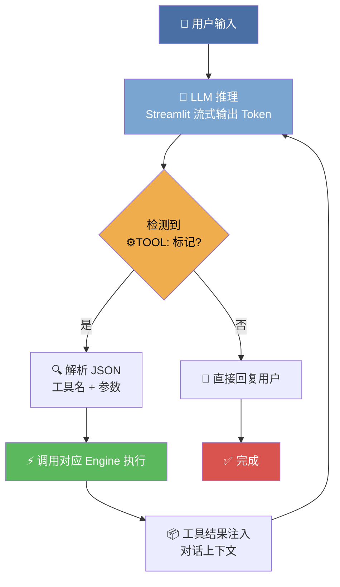
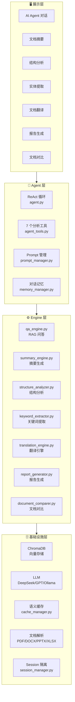

# AI 智能文档分析平台

> 手写 ReAct Agent + RAG 的全栈文档分析系统。一句话指令，自动完成多步分析。


---

## 📖 目录

- [🏗️ 系统架构](#-系统架构)
- [✨ 功能概览](#-功能概览)
- [🚀 快速开始](#-快速开始)
- [💡 技术亮点](#-技术亮点)
- [🧱 项目结构](#-项目结构)
- [🛠️ 技术栈](#-技术栈)
- [🧪 测试](#-测试)
- [🐳 Docker 部署](#-docker-部署)
- [❓ 面试常见问题](#-面试常见问题)
- [📸 快速演示](#-快速演示)

---

## 🏗️ 系统架构

### Agent ReAct 推理循环（核心）



> 核心思路：用纯文本标记 `⚙️TOOL:` + JSON 替代框架的 function calling，不依赖模型原生 tool_call 能力，可对接任意 LLM。Agent 在循环中流式输出 Token，检测到工具调用标记后暂停、执行工具、将结果回注上下文，继续推理直到产出最终答案。

### 分层架构



---

## ✨ 功能概览

用户只需输入一句话（如"总结这份文档并用日语导出报告"），系统自动拆解意图、分步调用分析工具，最终交付完整结果。

| 功能 | 说明 |
|------|------|
| 🧠 AI Agent | 自然语言驱动，自主判断意图、多步推理、调用工具 |
| 💬 智能问答 | RAG 检索增强，向量搜索 + LLM 生成，带来源引用 |
| 📝 文档摘要 | 5 种摘要类型（简短 / 详细 / 要点 / 执行摘要 / Q&A） |
| 🏗️ 结构分析 | 标题提取 + 文档类型/质量评估 + 目录生成 |
| 🔍 实体提取 | 关键词、行动项、主题提取 |
| 🌍 文档翻译 | 8 种语言互译，4 种格式下载（TXT/MD/PDF/DOCX） |
| 📊 报告生成 | 一键生成综合 Markdown 报告，支持 3 种模板 |
| 🔄 文档对比 | 相似度计算 + 差异摘要 + 逐行高亮 |

---

## 🚀 快速开始

### 环境要求

- Python 3.10+
- 任意兼容 OpenAI API 的 LLM（DeepSeek / GPT / Ollama）

### 安装运行

```bash
# 1. 安装依赖
pip install -r requirements.txt

# 2. 配置 API Key
cp .env.example .env
# 编辑 .env，填入你的 API Key 和 Base URL

# 3. 启动
streamlit run app.py
```

### Docker（推荐）

```bash
docker-compose up -d
```

浏览器打开 `http://localhost:8501` 即可使用。

---

## 💡 技术亮点

### 1. 手写 ReAct Agent，不依赖框架 function calling

LangGraph 与 DeepSeek reasoning 模型存在序列化兼容问题（`reasoning_content` 字段丢失导致 API 400）。

本项目用**纯文本标记 `⚙️TOOL:` + JSON** 替代框架的工具调用机制：

- ✅ 不依赖模型的 function calling 能力
- ✅ 可对接任意 LLM（DeepSeek / GPT / Ollama 即插即用）
- ✅ 工具调用过程完全透明、可调试
- ✅ 流式输出 Token 给用户，体感无等待

```
用户: "总结并翻译成日语"
  ↓
LLM 流式输出: ...⚙️TOOL:
{"name": "summarize_document", "arguments": {"style": "short"}}
⚙️END
  ↓ Agent 暂停 → 执行 summarize → 结果注入上下文
  ↓
LLM 继续流式输出: ...⚙️TOOL:
{"name": "translate_text", "arguments": {"target_language": "日本語"}}
⚙️END
  ↓ Agent 暂停 → 执行 translate → 结果注入上下文
  ↓
LLM 流式输出最终回复
```

### 2. 多 Provider 自动降级

`utils.py` 中实现了 LLM Provider 优先级链：DeepSeek → GPT → Ollama 本地模型。当首选 Provider 不可用时自动降级，保证服务可用性。

### 3. 语义缓存

`cache_manager.py` 对相似查询做语义去重：如果用户问的问题与历史查询语义相似度 > 阈值，直接返回缓存结果，大幅降低 Token 消耗和响应延迟。

### 4. Session 级 Agent 隔离

每个对话 Session 拥有独立的 Agent 实例、对话历史和工具上下文，多用户并发互不干扰。

### 5. 全 Mock 的测试体系

210 个 pytest 用例全部通过 Mock 隔离外部依赖，不依赖真实 API，CI 可重复运行。

---

## 🧱 项目结构

```
ai-doc-assistant/
├── app.py                    # Streamlit 入口
├── src/
│   ├── agent.py              # ReAct Agent 循环（核心）
│   ├── agent_tools.py        # 7 个分析工具
│   ├── prompt_manager.py     # System Prompt 管理
│   ├── memory_manager.py     # 对话记忆管理
│   ├── qa_engine.py          # RAG 问答引擎
│   ├── vector_store.py       # ChromaDB 向量存储
│   ├── summary_engine.py     # 摘要引擎（5 种类型）
│   ├── structure_analyzer.py # 文档结构分析
│   ├── keyword_extractor.py  # 关键词/实体提取
│   ├── translation_engine.py # 翻译引擎（8 语言 × 4 格式）
│   ├── report_generator.py   # 报告生成器
│   ├── document_comparer.py  # 文档对比引擎
│   ├── cache_manager.py      # 语义缓存
│   ├── session_manager.py    # Session 管理
│   ├── document_processor.py # 文档解析（PDF/DOCX/PPTX/XLSX）
│   ├── llm_enhancer.py       # LLM 增强工具
│   ├── history_manager.py    # 历史记录管理
│   ├── logger.py             # 日志
│   └── utils.py              # LLM Provider 工厂
├── ui/                       # Streamlit 界面组件
│   ├── app.py                # UI 入口
│   ├── agent_chat.py         # Agent 对话界面
│   ├── sidebar.py            # 侧边栏
│   ├── summary_tab.py        # 摘要 Tab
│   ├── structure_tab.py      # 结构分析 Tab
│   ├── entity_tab.py         # 实体提取 Tab
│   ├── translation_tab.py    # 翻译 Tab
│   ├── report_tab.py         # 报告 Tab
│   ├── compare_tab.py        # 对比 Tab
│   ├── document_viewer.py    # 文档查看器
│   ├── diff_viewer.py        # Diff 查看器
│   ├── theme.py              # 主题定制
│   └── utils.py              # UI 工具函数
├── tests/                    # 210 个 pytest 用例
├── Dockerfile
├── docker-compose.yml
├── requirements.txt
└── .env.example
```

---

## 🛠️ 技术栈

| 层级 | 技术 | 说明 |
|------|------|------|
| 🖥️ 前端 | Streamlit 1.32+ | 纯 Python Web UI，7 功能 Tab |
| 🧠 Agent | 自研 ReAct Loop | 文本标记驱动，不依赖 function calling |
| 🔍 RAG | LangChain + ChromaDB | 文档分块 → 向量化 → 相似度检索 → LLM 生成 |
| 🤖 LLM | DeepSeek / GPT / Ollama | 多 Provider 自动降级，兼容 OpenAI API |
| 📄 文档解析 | PyPDF2 / python-docx / openpyxl / python-pptx | 支持 PDF、DOCX、PPTX、XLSX、TXT、MD |
| 💾 缓存 | 语义相似度缓存 | 降低重复 Token 消耗 |
| 🧪 测试 | pytest + pytest-cov | 210 用例，Mock 全覆盖 |
| 📏 代码质量 | black / isort / mypy / ruff | 格式化 + 排序 + 类型检查 + Lint |
| 🐳 部署 | Docker + docker-compose | 一键部署 |

---

## 🧪 测试

```bash
# 运行全部测试
pytest tests/ -v

# 带覆盖率报告
pytest tests/ -v --cov=src --cov-report=term-missing
```

| 指标 | 数值 |
|------|------|
| 测试用例 | 210 |
| 测试框架 | pytest |
| Mock 策略 | 全量 Mock 外部依赖（LLM API、ChromaDB、文件 I/O） |

---

## 🐳 Docker 部署

```bash
docker-compose up -d
```

首次启动会自动构建镜像并安装依赖。服务默认监听 `8501` 端口。

环境变量通过 `.env` 文件注入，支持以下配置：

| 变量 | 说明 |
|------|------|
| `DEEPSEEK_API_KEY` | DeepSeek API Key |
| `DEEPSEEK_BASE_URL` | DeepSeek API 地址 |
| `OPENAI_API_KEY` | OpenAI API Key |
| `OLLAMA_BASE_URL` | Ollama 本地服务地址 |

---

## ❓ 面试常见问题

### Q: 为什么不用 LangChain/LangGraph 的 Agent？

LangGraph 的 AgentExecutor 在序列化 `AIMessage` 时，DeepSeek 推理模型特有的 `reasoning_content` 字段会丢失，导致 API 返回 400 错误。这是 DeepSeek 与 LangChain 框架的一个已知兼容问题。

手写 ReAct 循环直接控制消息格式，绕开了框架层的序列化逻辑，同时带来了更好的可调试性和 LLM 无关性。

### Q: Agent 如何避免无限循环？

`MAX_ITERATIONS = 5` 硬上限。超过 5 步推理仍未产出结果时，Agent 自动终止并提示用户简化请求。此外，System Prompt 中明确规定了"工具返回'请先上传文档'时直接告知用户，不要反复重试"等终止规则。

### Q: 如何处理长文档？

1. **文档分块**：`document_processor.py` 按语义边界切割文档，避免截断关键信息
2. **ChromaDB 向量化**：每个 Chunk 生成 Embedding 存入向量库
3. **RAG 检索**：问答时先 Top-K 相似度检索，仅将相关 Chunk 送入 LLM 上下文
4. **摘要策略**：超长文档先分段摘要，再对摘要做摘要（Map-Reduce 模式）

### Q: 语义缓存怎么实现的？

`cache_manager.py` 对每次查询生成 Embedding，与历史查询的 Embedding 计算余弦相似度。若相似度 > 0.95 阈值，视为语义等价查询，直接返回缓存结果，避免重复调用 LLM。

### Q: 多用户并发怎么隔离？

`session_manager.py` 为每个 Streamlit Session 创建独立的 Agent 实例，对话历史、工具上下文、文档状态全部隔离在 Session 作用域内，互不干扰。

---

## 📸 快速演示

> 启动项目后，打开 `http://localhost:8501`，上传一份文档即可体验。

### 演示场景

1. **Agent 多步推理** — 输入"总结文档核心观点并翻译成英文"，观察 Agent 自动依次调用 summarize → translate 两个工具
2. **RAG 智能问答** — 输入"文档中关于预算的部分说了什么？"，系统检索相关段落后生成带引用的回答
3. **一键报告** — 切换到报告 Tab，选择模板生成结构化 Markdown 报告

> 💡 提示：可以在 Streamlit Cloud 上免费部署 Demo，简历中附链接效果更佳。
