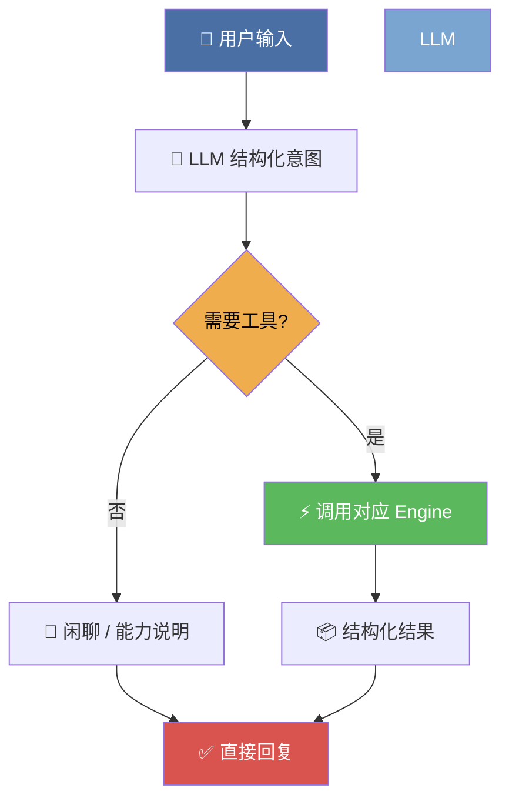
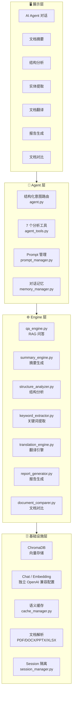

# AI 智能文档分析平台

> 基于可追溯 RAG 与结构化意图路由的文档分析系统。支持真实 OpenAI 兼容 API、本地 Streamlit 演示和中文 PDF/DOCX。


---

## 📖 目录

- [🏗️ 系统架构](#-系统架构)
- [✨ 功能概览](#-功能概览)
- [🚀 快速开始](#-快速开始)
- [💡 技术亮点](#-技术亮点)
- [🧱 项目结构](#-项目结构)
- [🛠️ 技术栈](#-技术栈)
- [🧪 测试](#-测试)
- [🐳 Docker 部署](#-docker-部署)
- [❓ 面试常见问题](#-面试常见问题)
- [📸 快速演示](#-快速演示)

---

## 🏗️ 系统架构

### 结构化 Agent 路由（核心）



> Agent 使用 Pydantic 模式约束工具名与参数，不解析模型生成的文本协议；无法可靠路由时直接回到同一文档的真实 RAG 检索链路。

### 分层架构



---

## ✨ 功能概览

用户只需输入一句话（如"总结这份文档并用日语导出报告"），系统自动拆解意图、分步调用分析工具，最终交付完整结果。

| 功能 | 说明 |
|------|------|
| 🧠 AI Agent | Pydantic 结构化意图路由，按顺序调用文档工具 |
| 💬 智能问答 | RAG 检索增强、真实 API 流式输出，带来源引用 |
| 📝 文档摘要 | 5 种摘要类型，真实 API 流式输出 |
| 🏗️ 结构分析 | 标题提取 + 文档类型/质量评估 + 目录生成 |
| 🔍 实体提取 | 关键词、行动项、主题提取 |
| 🌍 文档翻译 | 8 种语言互译，真实 API 流式输出，支持 4 种格式下载 |
| 📊 报告生成 | 一键生成综合 Markdown 报告，支持 3 种模板与流式输出 |
| 🔄 文档对比 | 相似度计算 + 差异摘要 + 逐行高亮 |

---

## 🚀 快速开始

### 环境要求

- Python 3.10+
- 可用的 OpenAI 兼容 Chat 与 Embedding API（两者独立配置）

### 安装运行

```bash
# 1. 安装依赖
pip install -r requirements.txt

# 2. 配置 API Key
cp .env.example .env
# 编辑 .env，填入你的 API Key 和 Base URL

# 3. 启动
streamlit run app.py
```

### Docker（推荐）

```bash
docker-compose up -d
```

浏览器打开 `http://localhost:8501` 即可使用。

运行期文件统一放在项目根目录下，便于备份和 Docker 挂载：

```text
data/    # Chroma 索引、缓存、会话与日志
models/  # 本地语义分块模型（首次使用自动下载）
```

`models/` 不会提交到 Git；Docker Compose 会将这两个目录挂载到容器中，重建容器不会丢失索引或重复下载本地模型。

---

## 💡 技术亮点

### 1. 结构化工具调用与 RAG 优先

工具路由使用 Pydantic 结构化输出，避免了不可靠的文本标记解析。文档相关问题先使用隔离索引检索，并将用于回答的同一批片段作为引用返回。

### 2. 明确、可验证的 API 配置

Chat 与 Embedding 分别由 `LLM_*` 和 `EMBEDDING_*` 环境变量配置，启动时校验缺失项。应用不再静默切换 Provider、预设回答或降级为伪实现。

### 3. 真实流式生成

RAG 问答、摘要、翻译与报告通过 OpenAI 兼容 API 的流式接口输出增量内容。结构、关键词和文档对比属于计算型任务，界面展示处理状态并在结果完成后返回，避免把完整字符串拆分成伪流式效果。

### 4. 本地语义分块与 Jina Embedding

中文 PDF/DOCX 保留页码、段落等来源元数据；`potion-multilingual-128M` 在本地执行语义分块，Jina Embedding V5 负责文档与查询向量化，并对检索与问答使用不同任务类型。

### 5. 语义缓存

`cache_manager.py` 对相似查询做语义去重：如果用户问的问题与历史查询语义相似度 > 阈值，直接返回缓存结果，大幅降低 Token 消耗和响应延迟。

### 6. Session 级 Agent 隔离

每个对话 Session 拥有独立的 Agent 实例、对话历史和工具上下文，多用户并发互不干扰。

### 7. 双层验收

默认测试使用边界替身保证可重复性；`live_api` 标记的集成测试会以真实 Chat/Embedding API 验证 DOCX 解析、索引、问答和页码/段落引用。

---

## 🧱 项目结构

```
ai-doc-assistant/
├── app.py                    # Streamlit 入口
├── api/                       # FastAPI 应用、路由与启动入口
│   ├── server.py              # FastAPI 进程入口
│   ├── main.py                # FastAPI 应用与路由注册
│   └── routes/                # API 路由
├── src/
│   ├── agent.py              # 结构化 Agent 路由
│   ├── agent_tools.py        # 7 个分析工具
│   ├── prompt_manager.py     # System Prompt 管理
│   ├── memory_manager.py     # 对话记忆管理
│   ├── qa_engine.py          # RAG 问答引擎
│   ├── vector_store.py       # ChromaDB 向量存储
│   ├── summary_engine.py     # 摘要引擎（5 种类型）
│   ├── structure_analyzer.py # 文档结构分析
│   ├── keyword_extractor.py  # 关键词/实体提取
│   ├── translation_engine.py # 翻译引擎（8 语言 × 4 格式）
│   ├── report_generator.py   # 报告生成器
│   ├── document_comparer.py  # 文档对比引擎
│   ├── cache_manager.py      # 语义缓存
│   ├── session_manager.py    # Session 管理
│   ├── document_processor.py # PDF/DOCX 解析、来源元数据与分块
│   ├── document_service.py   # 文档隔离索引与可追溯 RAG
│   ├── semantic_chunker.py   # 小型本地语义分块模型
│   ├── application_service.py# UI/API 共用服务边界
│   ├── llm_enhancer.py       # LLM 增强工具
│   ├── history_manager.py    # 历史记录管理
│   ├── logger.py             # 日志
│   └── utils.py              # OpenAI 兼容客户端工厂
├── ui/                       # Streamlit 界面组件
│   ├── app.py                # UI 入口
│   ├── agent_chat.py         # Agent 对话界面
│   ├── sidebar.py            # 侧边栏
│   ├── summary_tab.py        # 摘要 Tab
│   ├── structure_tab.py      # 结构分析 Tab
│   ├── entity_tab.py         # 实体提取 Tab
│   ├── translation_tab.py    # 翻译 Tab
│   ├── report_tab.py         # 报告 Tab
│   ├── compare_tab.py        # 对比 Tab
│   ├── document_viewer.py    # 文档查看器
│   ├── diff_viewer.py        # Diff 查看器
│   ├── theme.py              # 主题定制
│   └── utils.py              # UI 工具函数
├── tests/                    # 单元、服务与可选真实 API 集成测试
├── scripts/                  # 本地开发和性能工具
│   └── benchmark.py          # 手动端到端性能基准
├── Dockerfile
├── docker-compose.yml
├── requirements.txt
└── .env.example
```

---

## 🛠️ 技术栈

| 层级 | 技术 | 说明 |
|------|------|------|
| 🖥️ 前端 | Streamlit 1.32+ | 纯 Python Web UI，7 功能 Tab |
| 🧠 Agent | Pydantic + LangChain | 结构化意图与工具参数 |
| 🔍 RAG | LangChain + ChromaDB | 文档分块 → 向量化 → 相似度检索 → LLM 生成 |
| 🤖 LLM | OpenAI-compatible APIs | Chat / Embedding 独立配置、超时与重试 |
| 📄 文档解析 | pypdf / python-docx / model2vec | 中文 PDF/DOCX、语义分块、来源定位 |
| 💾 缓存 | 语义相似度缓存 | 降低重复 Token 消耗 |
| 🧪 测试 | pytest + pytest-cov | 可重复单元测试 + opt-in 真实 API 验收 |
| 📏 代码质量 | black / isort / mypy / ruff | 格式化 + 排序 + 类型检查 + Lint |
| 🐳 部署 | Docker + docker-compose | 一键部署 |

---

## 🧪 测试

```bash
# 运行全部测试
pytest tests/ -v

# 带覆盖率报告
pytest tests/ -v --cov=src --cov-report=term-missing

# 使用真实 API 验证 DOCX RAG（需要完整 .env）
RUN_LIVE_API=1 pytest tests/test_live_rag.py -m live_api -q
```

| 指标 | 数值 |
|------|------|
| 测试用例 | 以当前 `pytest tests/ -q` 输出为准 |
| 测试框架 | pytest |
| 验收策略 | 单元测试隔离外部边界；真实 API 测试显式 opt-in |

---

## 🐳 Docker 部署

```bash
docker-compose up -d
```

首次启动会自动构建镜像并安装依赖。服务默认监听 `8501` 端口。

环境变量通过 `.env` 文件注入，支持以下配置：

| 变量 | 说明 |
|------|------|
| `LLM_API_KEY` / `LLM_BASE_URL` / `LLM_MODEL` | Chat API 配置 |
| `LLM_TIMEOUT` / `LLM_MAX_RETRIES` / `LLM_MAX_TOKENS` | Chat 超时、重试与最大输出长度 |
| `EMBEDDING_API_KEY` / `EMBEDDING_BASE_URL` / `EMBEDDING_MODEL` | Embedding API 配置 |

---

## ❓ 面试常见问题

### Q: 如何避免 Agent 路由不可靠？

模型必须返回符合 Pydantic 模式的工具名与参数，非法路由不会被当作文本协议执行；对于普通文档提问或路由失败，系统直接使用当前文档的 RAG 检索链路回答。

### Q: Agent 如何避免无限循环？

工具调用使用有限的结构化调用序列；单次请求不依赖模型生成循环控制文本，失败时会返回清晰错误或回到 RAG 回答。

### Q: 如何处理长文档？

1. **文档分块**：`document_processor.py` 按语义边界切割文档，避免截断关键信息
2. **ChromaDB 向量化**：每个 Chunk 生成 Embedding 存入向量库
3. **RAG 检索**：问答时先 Top-K 相似度检索，仅将相关 Chunk 送入 LLM 上下文
4. **摘要策略**：超长文档先分段摘要，再对摘要做摘要（Map-Reduce 模式）

### Q: 语义缓存怎么实现的？

`cache_manager.py` 对每次查询生成 Embedding，与历史查询的 Embedding 计算余弦相似度。若相似度 > 0.95 阈值，视为语义等价查询，直接返回缓存结果，避免重复调用 LLM。

### Q: 多用户并发怎么隔离？

`session_manager.py` 为每个 Streamlit Session 创建独立的 Agent 实例，对话历史、工具上下文、文档状态全部隔离在 Session 作用域内，互不干扰。

---

## 📸 快速演示

> 启动项目后，打开 `http://localhost:8501`，上传一份文档即可体验。

### 演示场景

1. **Agent 多步推理** — 输入"总结文档核心观点并翻译成英文"，观察 Agent 自动依次调用 summarize → translate 两个工具
2. **RAG 智能问答** — 输入"文档中关于预算的部分说了什么？"，系统检索相关段落后生成带引用的回答
3. **一键报告** — 切换到报告 Tab，选择模板生成结构化 Markdown 报告

> 💡 提示：可以在 Streamlit Cloud 上免费部署 Demo，简历中附链接效果更佳。
